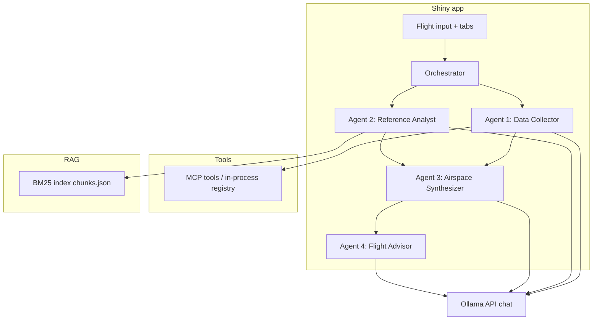
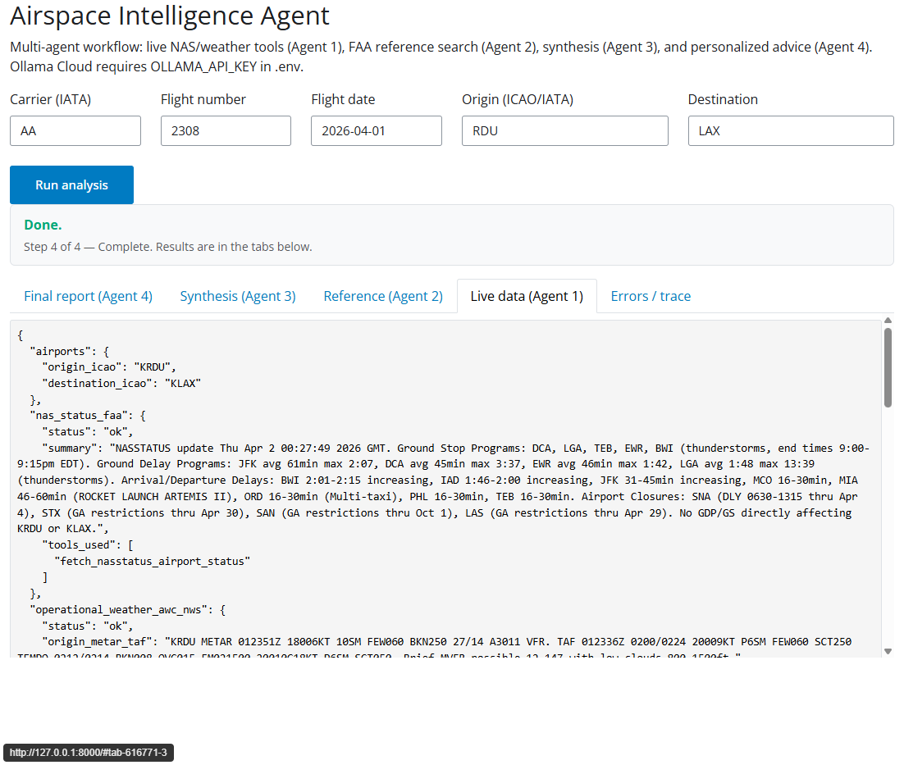
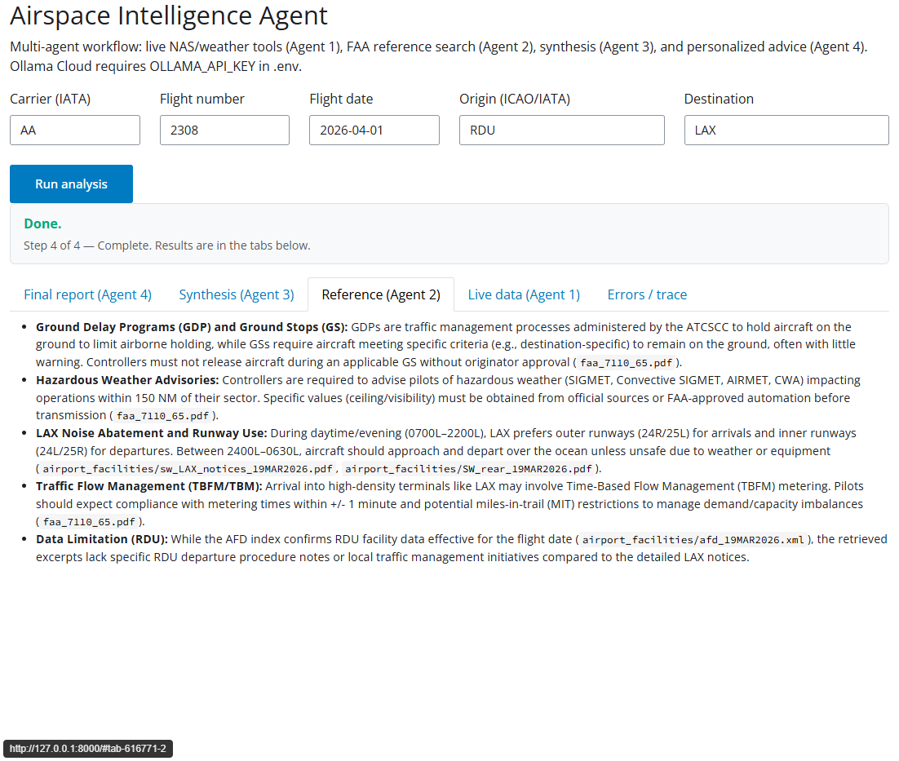
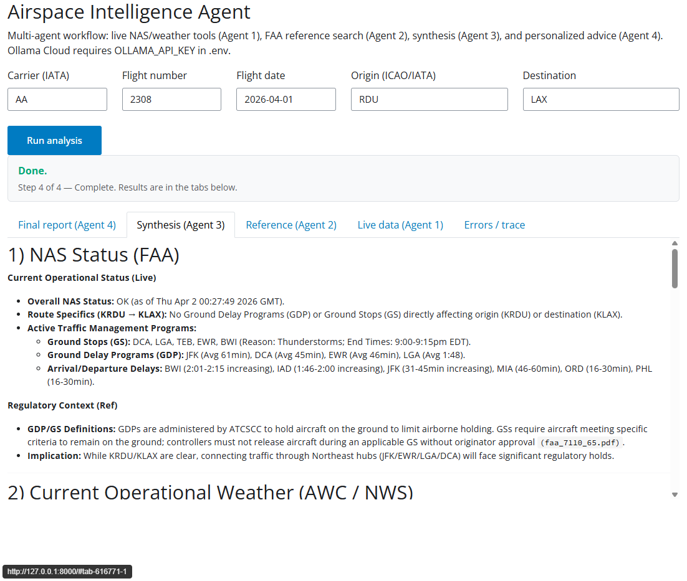
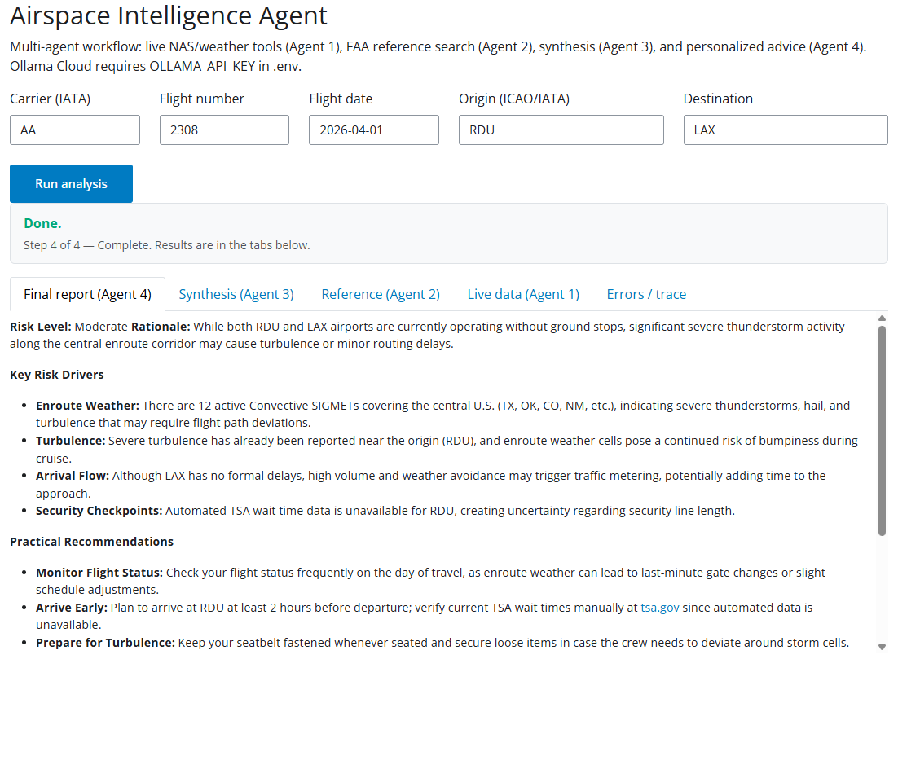

# Airspace Intelligence Agent — App V3

Shiny for Python dashboard that runs a four-agent workflow: live NAS and weather data via MCP-style tools (Agent 1), BM25 search over FAA reference material (Agent 2), network-level synthesis (Agent 3), and a personalized flight report (Agent 4). LLM calls use **Ollama Cloud** or a **local Ollama** server, configured through `.env`.

## Table of Contents

- [Overview](#overview)
- [Architecture](#architecture)
- [RAG layer](#rag-layer)
- [MCP tools](#mcp-tools)
- [Multi-agent workflow](#multi-agent-workflow)
- [Screenshots](#screenshots)
- [Requirements](#requirements)
- [Installation](#installation)
- [Configuration](#configuration)
- [Run locally](#run-locally)
- [Deploy (Posit Connect)](#deploy-posit-connect)
- [Repository layout](#repository-layout)
- [License and disclaimers](#license-and-disclaimers)

## Overview

- **Live data** comes from HTTP APIs (FAA NAS status, aviationweather.gov, NOAA alerts, TFR feed, optional TSA proxy, optional OpenSky) exposed as **named tools** with JSON schemas.
- **Reference knowledge** comes from ingested FAA Order 7110.65–style material and airport facility data; search is **keyword BM25**, not embeddings.
- The **UI** (`app/shiny_app.py`) collects carrier, flight number, date, origin, and destination; shows workflow status; and exposes each agent’s output in tabs.

## Architecture



When `MCP_BASE_URL` is unset, Agent 1 calls the same tool implementations **in process** from `mcp_server.tools` (no separate server required for local runs). Set `MCP_BASE_URL` to point at a deployed MCP HTTP/SSE server if you need remote tool execution.

## RAG layer

- **Sources**: PDF/XML (and similar) under [`app/rag/data/`](app/rag/data/) — for example FAA order excerpts and airport facility material. Paths are configurable via `RAG_DATA_DIR`.
- **Ingestion**: [`app/rag/ingest.py`](app/rag/ingest.py) builds chunked text and writes [`app/rag/data/index/chunks.json`](app/rag/data/index/chunks.json) (and related airport index files where applicable).
- **Search**: [`app/rag/search.py`](app/rag/search.py) implements `search_reference(query, top_k=...)` using **BM25** (`rank_bm25`), with light stop-word filtering and tokenization. Returns ranked dicts with `source`, `section`, `content`, and `score` (fields may vary slightly by index version).

Run ingestion after adding or changing documents:

```bash
python -m app.rag.ingest
```

## MCP tools

| Tool | Purpose | Main parameters | Returns (summary) |
|------|---------|-----------------|-------------------|
| `fetch_nasstatus_airport_status` | FAA NAS airport status (GDPs, ground stops) | `url?`, `include_parsed_json?` | JSON: NAS delay data |
| `get_metar` | METAR for an ICAO station | `station_id`, `hours_back?` | JSON with observation text |
| `get_taf` | TAF for an ICAO station | `station_id` | JSON with forecast text |
| `get_sigmets` | SIGMETs | `hazard_type?` | JSON array of advisories |
| `get_gairmets` | G-AIRMETs | `hazard_type?` | JSON array |
| `get_pireps` | PIREPs | `station_id?`, `distance_nm?` | JSON array |
| `get_weather_alerts` | NWS active alerts | `area?`, `severity?` | JSON alerts |
| `get_active_tfrs` | Active TFRs | `max_features?`, `include_geometry?` | JSON features |
| `get_aircraft_states` | OpenSky ADS-B states | `icao24?`, `bounding_box?` | JSON state vectors |
| `get_tsa_wait_times` | TSA waits (best-effort; proxy supported) | `airport_code` | JSON / error JSON |
| `url_query` | Fetch URL, clean text | `url`, `max_chars?` | Plain text |
| `web_search_general` | DuckDuckGo-style search | `query`, `max_results?` | JSON summary |

**Agent 1 default tool set** excludes `get_aircraft_states`, `url_query`, and `web_search_general` unless you change the allowlist in [`mcp_server/tools/registry.py`](mcp_server/tools/registry.py) (`DEFAULT_AGENT_TOOL_SCHEMAS` vs `ALL_TOOL_SCHEMAS`).

## Multi-agent workflow

1. **Agent 1 (Data Collector)** — Calls tools in a loop with the Ollama chat API; returns structured JSON-style text for live NAS, weather, TFRs, and related fields along the route.
2. **Agent 2 (Reference Analyst)** — Issues BM25 queries derived from the flight context and returns ranked FAA excerpts.
3. **Agent 3 (Airspace Synthesizer)** — Merges Agent 1 and Agent 2 outputs into a network-level narrative.
4. **Agent 4 (Flight Advisor)** — Produces risk level, drivers, recommendations, and disclaimers for the specific flight.

Agents 1 and 2 run **in parallel**; Agent 3 runs after both complete; Agent 4 runs last. See [`app/agents/orchestrator.py`](app/agents/orchestrator.py).

## Screenshots

Captured from the local Shiny app (`python app/run_me.py`, default **http://127.0.0.1:8000**). Order follows the agent pipeline (1 → 4).

**Live data (Agent 1)** — JSON from tool calls (e.g. NAS status, METAR/TAF, tools used).



**Reference (Agent 2)** — FAA and facility excerpts retrieved via BM25 RAG.



**Synthesis (Agent 3)** — network-level merge of live data and reference context (e.g. NAS Status, operational weather sections).



**Final report (Agent 4)** — personalized output after the workflow completes.



## Requirements

- Python 3.10+ recommended (match your environment with [`requirements.txt`](requirements.txt)).
- Network access to Ollama Cloud or a reachable **local Ollama** instance.
- Optional: **Posit Connect** and `rsconnect-python` for deployment.

## Installation

From the **`App V3 New Arch`** directory (this folder):

```bash
pip install -r requirements.txt
```

Copy [`.env.example`](.env.example) to `.env` and set variables (see [Configuration](#configuration)).

## Configuration

| Variable | Role |
|----------|------|
| `OLLAMA_API_KEY` | Required for **Ollama Cloud** (`OLLAMA_HOST` default `https://ollama.com`). |
| `OLLAMA_HOST` | Chat API base (e.g. `http://127.0.0.1:11434` for local Ollama). |
| `OLLAMA_MODEL` | Model name (default `qwen3.5:397b`). |
| `OLLAMA_TEMPERATURE` | Sampling temperature for chat. |
| `MCP_BASE_URL` | If set, tools are invoked over HTTP against your MCP server; if empty, tools run in-process. |
| `RAG_DATA_DIR` | Override path to RAG data (defaults under `app/rag/data`). |
| `TSA_WAIT_TIMES_PROXY_URL` | Optional alternate URL for TSA JSON when the legacy endpoint fails. |
| `OPENSKY_CLIENT_ID` / `OPENSKY_CLIENT_SECRET` | Optional OpenSky OAuth (anonymous access has lower limits). |
| `POSIT_CONNECT_PUBLISHER` | API key for `rsconnect` when deploying. |

## Run locally

```bash
python app/run_me.py
```

Open **http://127.0.0.1:8000** (override with `SHINY_HOST` / `SHINY_PORT`). Optional MCP server:

```bash
python mcp_server/run_me.py
```

See [`simple_run.md`](simple_run.md) for a short checklist.

## Deploy (Posit Connect)

- [`app/deploy.py`](app/deploy.py) and [`mcp_server/deploy.py`](mcp_server/deploy.py) are stubs: set `POSIT_CONNECT_PUBLISHER`, install `rsconnect-python`, and fill in your Connect server URL, app name, and `rsconnect` deploy calls.
- Bundle the same `app/rag/data/` tree (including `index/`) when publishing so Agent 2 works in production.

## Repository layout

| Path | Role |
|------|------|
| [`app/shiny_app.py`](app/shiny_app.py) | Shiny UI entry (`shiny run app/shiny_app.py`). |
| [`app/run_me.py`](app/run_me.py) | Local dev launcher with reload. |
| [`app/agents/`](app/agents/) | Orchestrator and four agents. |
| [`app/rag/`](app/rag/) | Ingest, search, `data/`. |
| [`app/core/`](app/core/) | Config, Ollama client, MCP client. |
| [`mcp_server/`](mcp_server/) | FastMCP server, tool modules, `registry.py`. |
| [`screenshots/`](screenshots/) | README images. |

Project-wide conventions: [`.cursor/rules/`](../.cursor/rules/) (for example [`coding_style.mdc`](../.cursor/rules/coding_style.mdc) for Python). High-level product plan: [`PLAN.md`](../PLAN.md) at repo root.

## License and disclaimers

Outputs are **AI-generated** and **not** official FAA or airline information. Always verify operational decisions with dispatch, ATC, and your carrier. Government data sources (FAA, NOAA, NWS) remain subject to their respective terms of use.
