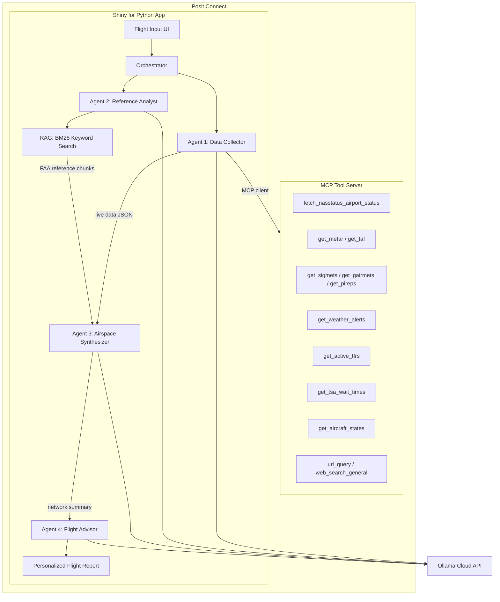
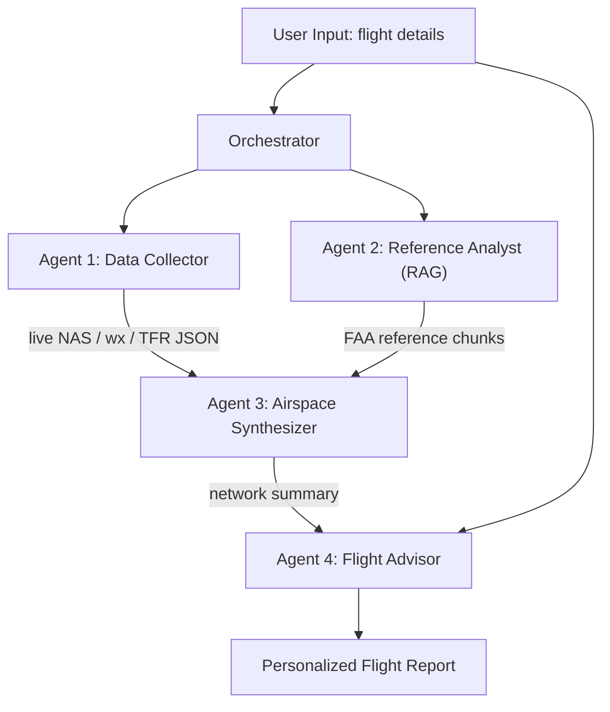

# Airspace Intelligence Agent — Project Plan

## Overview

An AI-powered application that builds a real-time understanding of the US airspace picture — including significant weather systems, FAA ground stops, TFRs, and TSA delays — and uses that context to predict the impact on a specific flight.

The system uses a **multi-agent workflow** with **tool-calling** for live data fetching (via an MCP server) and **RAG** (keyword search over FAA documents) for reference knowledge, synthesizing both into a structured impact prediction delivered through a **Shiny for Python** dashboard.

This plan builds on the working proof of concept in [`lab proof of concept/`](lab%20proof%20of%20concept/).

---

## Architecture



### Layer Summary

```
MCP Tool Server (Posit Connect)
├── FAA NASSTATUS API              → Ground stops, GDPs, en route programs
├── aviationweather.gov API        → METARs, TAFs, SIGMETs, G-AIRMETs, PIREPs
├── NOAA api.weather.gov           → Active weather alerts
├── FAA TFR Feed                   → Temporary Flight Restrictions
├── OpenSky Network API            → Live ADS-B aircraft position data
├── MyTSA Endpoint                 → Airport security wait times
├── url_query                      → Fetch and clean any web page
└── web_search_general             → DuckDuckGo search results

RAG Knowledge Layer (BM25 Keyword Search)
├── FAA Order 7110.65              → ATC procedures, ground stop reasoning
└── Airport facility directories   → Runway configs, known weather sensitivities

Agent Orchestration Layer (Ollama Cloud)
├── Agent 1: Data Collector        → Calls MCP tools for live airspace data
├── Agent 2: Reference Analyst     → Keyword-searches FAA documents via RAG
├── Agent 3: Airspace Synthesizer  → Merges live data + reference context
└── Agent 4: Flight Advisor        → Personalized flight impact prediction

Presentation Layer (Shiny for Python on Posit Connect)
├── Flight input form              → Carrier, flight number, date, origin, destination
├── Collapsible result panels      → Live data, reference context, summary, report
└── Workflow status indicators     → Agent progress feedback
```

---

## AI Provider

- **Ollama Cloud** at `https://ollama.com/api/chat`
- Authenticated via `OLLAMA_API_KEY` from `.env`
- Model specified by `OLLAMA_MODEL` from `.env` (currently `qwen3.5:397b`)
- Reuses the `agent()` / `agent_run()` wrapper pattern from [`lab proof of concept/functions.py`](lab%20proof%20of%20concept/functions.py), refactored into `app/core/ollama_client.py`

---

## Multi-Agent Workflow

Four agents coordinated by an orchestrator. Agents 1 and 2 run in parallel; Agent 3 waits for both; Agent 4 receives the synthesis plus the original user input.



### Agent 1 — Data Collector (tool-calling)

- **Purpose**: Gather live airspace, weather, and operational data via MCP tools.
- **Tools available**: `fetch_nasstatus_airport_status`, `get_metar`, `get_taf`, `get_sigmets`, `get_gairmets`, `get_pireps`, `get_weather_alerts`, `get_active_tfrs`, `get_aircraft_states`, `get_tsa_wait_times`, `url_query`, `web_search_general`.
- **Output**: Structured JSON containing current NAS status, weather at origin/destination, en route hazards, TFRs, and TSA wait times.
- **Role prompt**: Instructs the agent to call each relevant tool, focus on the user's route corridor, and produce machine-readable output for Agent 3.

### Agent 2 — Reference Analyst (RAG with keyword search)

- **Purpose**: Retrieve interpretive context from FAA reference documents.
- **RAG function**: `search_reference(query, top_k=5)` — BM25 keyword search over chunked FAA documents.
- **Output**: Ranked list of relevant document chunks with source, section, and content.
- **Role prompt**: Given the user's flight details, formulate keyword queries (e.g., airport identifiers, "ground delay program", "convective SIGMET procedures") and return the most relevant reference material for Agent 3.

### Agent 3 — Airspace Synthesizer

- **Purpose**: Merge live data from Agent 1 with reference context from Agent 2 into a network-level airspace summary.
- **Output**: Structured plain-text report with sections:
  - NAS Status (FAA)
  - Current Operational Weather (AWC)
  - System-Level Delays and Cancellations
  - Other Operational Factors (NOTAMs, TFRs, airline/airport issues)
  - Network-Level Summary by Region and Hub
- **Role prompt**: Synthesize the two inputs, clearly distinguish live data from reference context, highlight the top 3-5 most impacted hubs, and note trends through the day.

### Agent 4 — Flight Advisor

- **Purpose**: Interpret the network summary for a specific passenger's flight.
- **Output**: Personalized report with:
  - Plain-language risk summary (low / moderate / high)
  - Key risk drivers (weather, congestion, ATC programs)
  - Practical recommendations (arrival time, waivers, alternative flights)
  - Uncertainty disclaimers
- **Role prompt**: Translate network-level disruptions into concrete traveler-focused guidance for the user's specific carrier, flight number, date, origin, and destination.

---

## Agent Tool Definitions (MCP Server)

All tools are registered on the MCP server with OpenAI-style function metadata. Each tool has a Python implementation, a `name`, `description`, and `parameters` (JSON Schema).

| Tool | Data Source | Purpose | Parameters | Returns |
|------|------------|---------|------------|---------|
| `fetch_nasstatus_airport_status` | FAA NASSTATUS `nasstatus.faa.gov/api/airport-status-information` | Active GDPs, ground stops, closures, en route programs | `url?` (str), `include_parsed_json?` (bool, default true) | JSON: source, url, http_status, update_time, parsed NAS delay data |
| `get_metar` | aviationweather.gov `/api/data/metar` | Current airport weather observations | `station_id` (str, ICAO code, required), `hours_back?` (int, default 1) | METAR text + decoded weather conditions as JSON |
| `get_taf` | aviationweather.gov `/api/data/taf` | Terminal aerodrome forecast | `station_id` (str, ICAO code, required) | TAF text + decoded forecast periods as JSON |
| `get_sigmets` | aviationweather.gov `/api/data/sigmet` | Significant meteorological advisories (convective, turbulence, icing) | `hazard_type?` (str: convective / turbulence / icing) | Active SIGMETs as JSON array with area, altitude, hazard details |
| `get_gairmets` | aviationweather.gov `/api/data/gairmet` | Graphical area advisories (replaced CONUS AIRMETs Jan 2025) | `hazard_type?` (str: IFR / mountain_obscuration / turbulence / icing / freezing_level) | Active G-AIRMETs as JSON array with forecast polygons and time periods |
| `get_pireps` | aviationweather.gov `/api/data/pirep` | Pilot weather reports along route | `station_id?` (str), `distance_nm?` (int, default 100) | Recent PIREPs as JSON array with location, altitude, conditions |
| `get_weather_alerts` | NOAA `api.weather.gov/alerts/active` | Active NWS weather alerts | `area?` (str, state code), `severity?` (str: extreme / severe / moderate) | Alerts JSON with event type, headline, affected areas, timestamps |
| `get_active_tfrs` | FAA TFR feed `tfr.faa.gov` | Temporary Flight Restrictions | *(none)* | Active TFR list as JSON with notam_id, type, location, altitude, times |
| `get_aircraft_states` | OpenSky Network `opensky-network.org/api/states/all` | Live ADS-B aircraft position and velocity data | `icao24?` (str, hex transponder address), `bounding_box?` (dict with lamin/lomin/lamax/lomax) | State vectors as JSON: callsign, position, altitude, velocity, heading, vertical_rate |
| `get_tsa_wait_times` | MyTSA `apps.tsa.dhs.gov/MyTSAWebService/GetConfirmedWaitTimes.ashx` | Airport security checkpoint wait times (best-effort; may be intermittently unavailable) | `airport_code` (str, required) | Wait time data: current wait, checkpoint info |
| `url_query` | Any URL | Fetch a web page and return cleaned text content | `url` (str, required), `max_chars?` (int, default 20000) | Cleaned page text (HTML stripped, whitespace normalized) |
| `web_search_general` | DuckDuckGo Instant Answer API | General web search for live information | `query` (str, required), `max_results?` (int, default 5) | Summarized search results with headings, abstracts, related topics |

### Tool Metadata Format

Each tool is registered with the MCP server using this schema pattern (extending [`lab proof of concept/faa_nasstatus_tool.py`](lab%20proof%20of%20concept/faa_nasstatus_tool.py)):

```python
{
    "type": "function",
    "function": {
        "name": "tool_name",
        "description": "What this tool does and when to use it.",
        "parameters": {
            "type": "object",
            "properties": {
                "param_name": {
                    "type": "string",
                    "description": "What this parameter controls."
                }
            },
            "required": ["param_name"]
        }
    }
}
```

---

## RAG Pipeline

### Data Sources

- **FAA Order 7110.65** — Air Traffic Control procedures manual. Covers ground delay program procedures, ground stop reasoning, separation standards, and weather-related operational procedures.
- **Airport facility directories** — Runway configurations, known weather sensitivities, instrument approach capabilities, and operational constraints for major US airports.

### Where to obtain documents (official downloads)

| Document | Where to download (official FAA) | Save under (repo / deployment) |
|----------|----------------------------------|--------------------------------|
| **FAA Order JO 7110.65** (Air Traffic Control) | [Current order — 7110.65](https://www.faa.gov/regulations_policies/orders_notices/index.cfm/go/document.current/documentnumber/7110.65) lists the latest PDFs (Basic and with changes). Example direct PDF pattern: `faa.gov/documentLibrary/media/Order/7110.65*_Basic*.pdf` — filenames change when the order is revised; always use the current link on that page. | [`app/rag/data/faa_7110_65.pdf`](app/rag/data/faa_7110_65.pdf) (single consolidated PDF you choose: Basic or full with changes) |
| **Chart Supplement / Airport & Facility data** | [Digital Chart Supplement (d-CS)](https://www.faa.gov/air_traffic/flight_info/aeronav/digital_products/dafd/) — browse or use [Advanced Search](https://www.faa.gov/air_traffic/flight_info/aeronav/digital_products/dafd/search/advanced/) to download regional PDF volumes (US is split into multiple volumes; Alaska and Pacific are separate). Updates about every 56 days. | [`app/rag/data/airport_facilities/`](app/rag/data/airport_facilities/) — one PDF per volume you need (e.g. `ne_*.pdf`, `se_*.pdf`, …), named clearly so ingestion can glob them |

**Deployment on Posit Connect:** Bundle the same `app/rag/data/` tree with the published app (include PDFs in the deployment directory or commit them if the repo is private and licensing allows). The ingest/search code should resolve paths relative to the app root or an env var such as `RAG_DATA_DIR` so Connect can override the folder if needed. Large PDFs may push deployment size limits — trim to volumes covering your target regions if necessary.

**Licensing / use:** FAA orders and Chart Supplements are US government publications; cite the FAA when redistributing excerpts. For course or internal use, storing copies under `app/rag/data/` for offline RAG is standard.

### Ingestion (`app/rag/ingest.py`)

1. Extract text from PDF files using `PyMuPDF` (`fitz`).
2. Chunk by **logical section headings** (chapter, section, subsection), not by page breaks — procedural units are more useful than arbitrary page divisions.
3. Each chunk stores: `source` (filename), `section` (heading hierarchy), `content` (text), `chunk_id`.
4. Chunks are serialized to a JSON index file for fast reloading.

### Keyword Search Index (`app/rag/search.py`)

- **Algorithm**: BM25 via the `rank_bm25` library. No vector database or embedding model required.
- **Tokenization**: Lowercase, split on whitespace and punctuation, remove common stop words.
- **Search function**:

```python
def search_reference(query: str, top_k: int = 5) -> list[dict]:
    """
    Search the FAA document index by keyword relevance.

    Parameters
    ----------
    query : str
        Natural-language search query (e.g., "ground delay program ORD convective weather").
    top_k : int
        Number of top-ranked chunks to return.

    Returns
    -------
    list[dict]
        Ranked chunks: [{"source", "section", "content", "score"}, ...]
    """
```

### Design Principles

- **Tool-calling for live data, RAG for reference knowledge** — never RAG over flight or weather data; always fetch fresh via tools.
- **Keyword search over semantic search** — BM25 is lightweight, interpretable, and sufficient for structured FAA documents with consistent terminology.
- **Chunk by meaning** — FAA procedures are organized hierarchically; preserve that structure in chunks.

---

## Suggested File Structure

```
Agentic-Flight-Report/
├── PLAN.md                            # This file
├── README.md                          # Human-facing README (developer_readme_format.mdc)
├── README_CURSOR.md                   # Cursor-facing README (cursor_readme_format.mdc)
├── .env                               # OLLAMA_API_KEY, OLLAMA_MODEL, POSIT_CONNECT_PUBLISHER
├── .env.example                       # Key names without values (commit this)
├── requirements.txt                   # All Python dependencies with versions
│
├── mcp_server/                        # MCP Tool Server (deployed to Posit Connect)
│   ├── __init__.py
│   ├── server.py                      # MCP server entry point (mcp SDK + SSE transport)
│   ├── tools/
│   │   ├── __init__.py
│   │   ├── faa_nasstatus.py           # fetch_nasstatus_airport_status (from lab POC)
│   │   ├── aviation_weather.py        # get_metar, get_taf, get_sigmets, get_gairmets, get_pireps
│   │   ├── noaa_weather.py            # get_weather_alerts
│   │   ├── faa_tfr.py                 # get_active_tfrs
│   │   ├── opensky.py                 # get_aircraft_states (OpenSky Network ADS-B)
│   │   ├── tsa_wait_times.py          # get_tsa_wait_times
│   │   └── web_search.py             # url_query, web_search_general
│   └── (see App V3 For Deployment/scripts/)  # rsconnect deploy fastapi — HTTP bridge
│
├── app/                               # Main Shiny Application (deployed to Posit Connect)
│   ├── app.py                         # Shiny for Python entry point
│   ├── agents/                        # Multi-agent orchestration
│   │   ├── __init__.py
│   │   ├── orchestrator.py            # Workflow coordinator (runs agents 1-4)
│   │   ├── data_collector.py          # Agent 1: tool-calling data collection
│   │   ├── reference_analyst.py       # Agent 2: RAG keyword search over FAA docs
│   │   ├── airspace_synthesizer.py    # Agent 3: network-level synthesis
│   │   └── flight_advisor.py          # Agent 4: personalized flight report
│   ├── rag/                           # RAG implementation
│   │   ├── __init__.py
│   │   ├── ingest.py                  # PDF text extraction + section chunking
│   │   ├── search.py                  # BM25 keyword search index + search_reference()
│   │   └── data/                      # FAA reference documents
│   │       ├── faa_7110_65.pdf        # FAA Order 7110.65
│   │       └── airport_facilities/    # Airport facility directory PDFs
│   ├── core/                          # Shared infrastructure
│   │   ├── __init__.py
│   │   ├── ollama_client.py           # Ollama Cloud API client (from lab POC functions.py)
│   │   ├── mcp_client.py             # MCP client to call tool server
│   │   └── config.py                  # .env loading, constants
│   └── (see App V3 For Deployment/scripts/)  # rsconnect deploy shiny
│
├── screenshots/                       # Screenshots for README documentation
├── lab proof of concept/              # (preserved) Original lab POC
├── Agentic Flight Report V1 Local/    # (preserved) V1 local Ollama version
├── Agentic Flight Report V2 Cloud/    # (preserved) V2 cloud Ollama version
└── .cursor/rules/                     # Cursor rules (preserved)
```

---

## API Access Setup

### 1. Ollama Cloud (Agent Brain)
- **URL**: `https://ollama.com/`
- **Cost**: Pay-per-token via API key
- **Env vars**: `OLLAMA_API_KEY`, `OLLAMA_MODEL`

### 2. aviationweather.gov (NOAA Aviation Weather)
- **URL**: `https://aviationweather.gov/data/api/`
- **Cost**: Free, no authentication required
- **Endpoints**: `/api/data/metar`, `/api/data/taf`, `/api/data/sigmet`, `/api/data/gairmet`, `/api/data/pirep`
- **Rate limit**: 100 requests per minute; no more than 1 request/min per endpoint per thread. Set a custom User-Agent header to avoid automated filtering.
- **Env var**: None required

### 3. NOAA Weather API (api.weather.gov)
- **URL**: `https://www.weather.gov/documentation/services-web-api`
- **Cost**: Free, no API key required
- **Endpoints**: `/alerts/active`
- **Authentication**: Requires a **User-Agent header** identifying the application (not an API key). Format: `(appname, contact@email.com)`. NWS may replace this with an API key in the future.
- **Env var**: None required

### 4. FAA NASSTATUS (Ground Delays and Ground Stops)
- **URL**: `https://nasstatus.faa.gov/`
- **Cost**: Free, no authentication required
- **Endpoint**: `https://nasstatus.faa.gov/api/airport-status-information`
- **Env var**: None required

### 5. FAA TFR Feed
- **URL**: `https://tfr.faa.gov/`
- **Cost**: Free, no authentication required
- **Env var**: None required

### 6. OpenSky Network API
- **URL**: `https://opensky-network.org/apidoc/`
- **Cost**: Free. Anonymous access (400 credits/day per bucket); registered account (4000 credits/day); active feeders (8000 credits/day). No payment required at any tier.
- **Authentication**: **OAuth2 client credentials flow** (basic auth with username/password is no longer accepted). Register at `https://opensky-network.org/`, then create OAuth2 client credentials in your account.
- **Endpoints**: `/api/states/all` (live state vectors), `/api/flights/all` (flights in time range), `/api/tracks/all` (flight track waypoints)
- **Rate limits**: Credits tracked in three independent buckets (states, tracks, flights). Anonymous users get only most recent data with 10-second resolution. Authenticated users get up to 1 hour of history.
- **Note**: OpenSky may block requests from AWS/cloud-hosted IPs. Best called from non-hyperscaler environments.
- **Env vars**: `OPENSKY_CLIENT_ID`, `OPENSKY_CLIENT_SECRET` (optional — anonymous access works without these but with tighter rate limits)

### 7. MyTSA Wait Times
- **URL**: `https://apps.tsa.dhs.gov/MyTSAWebService/GetConfirmedWaitTimes.ashx`
- **Cost**: Free, no authentication required
- **Endpoint**: `?ap={airport_code}&output=json` for JSON format
- **Reliability note**: DHS noted in early 2026 that the site may not be actively managed due to a funding lapse. Treat as best-effort; the tool should degrade gracefully if this endpoint is unavailable.
- **Env var**: None required

### 8. DuckDuckGo Instant Answer API
- **URL**: `https://api.duckduckgo.com/`
- **Cost**: Free, no authentication required
- **Env var**: None required

---

## .env.example

```
# Ollama Cloud
OLLAMA_API_KEY=
OLLAMA_MODEL=qwen3.5:397b

# Posit Connect Deployment
POSIT_CONNECT_PUBLISHER=

# OpenSky Network (optional — anonymous access works without these but with tighter rate limits)
OPENSKY_CLIENT_ID=
OPENSKY_CLIENT_SECRET=

# No keys needed for:
# - aviationweather.gov
# - api.weather.gov
# - FAA NASSTATUS
# - FAA TFR feed
# - MyTSA endpoint
# - DuckDuckGo API
```

---

## Deployment

Both the MCP **HTTP tool bridge** (`mcp_server.http_bridge:app`, `POST /tools/call`) and the **Shiny** app deploy to **Posit Connect** using `rsconnect-python` and a publisher API key (`POSIT_CONNECT_PUBLISHER` or `CONNECT_API_KEY`) plus **`CONNECT_SERVER`** in `.env`. See **`App V3 For Deployment/scripts/deploy_mcp_http_bridge.py`** and **`App V3 For Deployment/scripts/deploy_shiny.py`**. For tools running in-process in the Shiny worker, omit a separate MCP deployment and leave `MCP_BASE_URL` unset.

---

## Agent Reasoning Loop (Example)

**User input**: "Analyze AA 849 DFW to BOS departing today"

```
Orchestrator: parse user input, start Agents 1 and 2 in parallel

Agent 1 (Data Collector — tool-calling):
  Step 1: [MCP] fetch_nasstatus_airport_status()     → NAS-wide ground stops, GDPs
  Step 2: [MCP] get_metar("KDFW"), get_metar("KBOS") → current weather at origin + destination
  Step 3: [MCP] get_taf("KDFW"), get_taf("KBOS")     → forecast weather
  Step 4: [MCP] get_sigmets()                         → convective SIGMETs along route
  Step 5: [MCP] get_weather_alerts(area="TX"), get_weather_alerts(area="MA")
  Step 6: [MCP] get_active_tfrs()                     → TFRs along route corridor
  Step 7: [MCP] get_aircraft_states(icao24="a]...")    → live position of target aircraft
  Step 8: [MCP] get_tsa_wait_times("DFW")             → security wait at departure
  → Output: structured JSON of all live data

Agent 2 (Reference Analyst — RAG):
  Step 1: [RAG] search_reference("DFW ground delay program")
  Step 2: [RAG] search_reference("convective weather ATC procedures")
  Step 3: [RAG] search_reference("BOS runway configuration IFR")
  → Output: ranked FAA reference chunks

Agent 3 (Airspace Synthesizer):
  Input: Agent 1 JSON + Agent 2 reference chunks
  → Output: network-level summary with NAS status, weather, delays, regional breakdown

Agent 4 (Flight Advisor):
  Input: Agent 3 summary + user flight details
  → Output: personalized risk assessment, recommendations, uncertainty disclaimers
```

**Key principle**: Tool-calling answers *"what is happening right now"*. RAG answers *"what does this mean and how bad is it typically"*.

---

## README Documentation (deferred until after build)

Two README files will be written after the application is built, deployed, and screenshots are captured.

### README.md — Human-Facing

Follows [`.cursor/rules/developer_readme_format.mdc`](.cursor/rules/developer_readme_format.mdc). Contents:

- System architecture (mermaid diagram of MCP server + agents + Shiny app)
- RAG data source description and keyword search function explanation
- Tool table: each tool's name, purpose, parameters, and return value
- Usage instructions: dependency installation, data source setup, API key configuration, how to run locally and deploy
- All other technical details (agent prompts, workflow description)
- Screenshots at contextually relevant locations: multi-agent workflow in action, RAG retrieval and response, function calling/tool usage

### README_CURSOR.md — Cursor-Facing

Follows [`.cursor/rules/cursor_readme_format.mdc`](.cursor/rules/cursor_readme_format.mdc). Contents:

- Project summary, file structure with roles, tech stack
- Entry points and run order
- Conventions and pointer to `.cursor/rules/`
- APIs and libraries with doc links
- Code examples with file references
- Reference links table

---

## MVP Build Order

1. **Project skeleton** — `requirements.txt`, `.env.example`, package directory structure with `__init__.py` files.
2. **MCP server tools** — Refactor lab POC `faa_nasstatus_tool.py` into `mcp_server/tools/`, implement remaining API tools with metadata.
3. **MCP server entry point** — Wire `server.py` with the `mcp` SDK, register all tools, verify locally.
4. **RAG pipeline** — Ingest FAA PDFs, build BM25 index, implement `search_reference()`.
5. **Ollama client** — Refactor lab POC `functions.py` into `app/core/ollama_client.py` with Ollama Cloud configuration.
6. **Agent modules** — `data_collector.py`, `reference_analyst.py`, `airspace_synthesizer.py`, `flight_advisor.py`.
7. **Orchestrator** — `orchestrator.py` coordinates agent 1-4 workflow with parallel execution of agents 1 and 2.
8. **Shiny app UI** — Flight input form, collapsible result panels, workflow status indicators.
9. **End-to-end test** — Run the full workflow against a live flight, inspect reasoning at each step.
10. **Deploy MCP server** — Publish to Posit Connect via `POSIT_CONNECT_PUBLISHER`.
11. **Deploy Shiny app** — Publish to Posit Connect, configure MCP server connection.
12. **Capture screenshots** — Multi-agent workflow in action, RAG retrieval, tool usage.
13. **Write READMEs** — Human-facing `README.md` and Cursor-facing `README_CURSOR.md`.

---

## Key Design Decisions

- **Tool-calling over RAG for live data** — never RAG over flight or weather data; always fetch fresh via MCP tools.
- **Keyword search over vector embeddings for RAG** — BM25 is lightweight, interpretable, and sufficient for structured FAA documents with consistent terminology. No vector database or embedding model required.
- **Parallel agent execution where possible** — Agents 1 and 2 run concurrently to reduce total workflow time.
- **MCP protocol for tool serving** — Decouples tool implementations from agent logic; tools are reusable across any MCP-compatible client.
- **Structured output between agents** — Each agent produces well-defined output (JSON or structured text) consumed by the next agent, enabling clear debugging and traceability.
- **Graceful degradation** — If a non-critical tool (e.g., TSA wait times) fails, the agent continues with available data and notes the gap in its output.
- **Shiny for Python UI** — Interactive dashboard for flight input and result display, deployable to Posit Connect alongside the MCP server.
