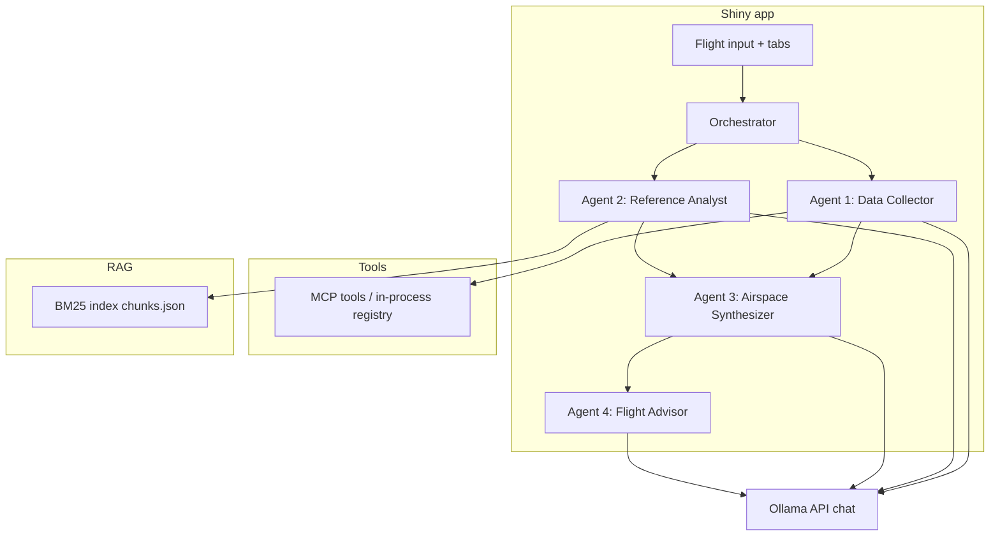

<a id="HOMEWORK"></a>

# 📌 Homework deliverable — Airspace Intelligence System

## 📋 Table of contents

- [1. Writing component (your own words; not AI-generated)](#1-writing-component-your-own-words-not-ai-generated)
- [2. Git repository links (paste your GitHub URLs)](#2-git-repository-links-paste-your-github-urls)
- [3. Screenshots (local run acceptable)](#3-screenshots-local-run-acceptable)
  - [3.1 Multi-agent workflow + tool usage (Agent 1 — live data / `tools_used`)](#toc-3-1)
  - [3.2 RAG retrieval and response (Agent 2 — reference)](#toc-3-2)
  - [3.3 Synthesis (Agent 3)](#toc-3-3)
  - [3.4 Final report (Agent 4)](#toc-3-4)
- [4. Documentation](#4-documentation)
  - [4.1 System architecture — agent roles and workflow](#toc-4-1)
  - [4.2 RAG data source and search](#toc-4-2)
  - [4.3 Tool functions (name, purpose, parameters, returns)](#toc-4-3)
  - [4.4 Technical details](#toc-4-4)
  - [4.5 Usage instructions](#toc-4-5)
- [License and disclaimers](#license-and-disclaimers)

---

## 1. Overview

*Replace everything in this subsection with **at least three paragraphs** you wrote yourself. The bullets are prompts; delete the bullets when you submit.*

- **What** does the system do for a user (inputs, outputs)?
- **How** do Shiny, the orchestrator, the four agents, tools, RAG, and the LLM fit together?
- **Design / challenges:** e.g. parallel Agents 1–2, BM25 vs embeddings, in-process tools vs `MCP_BASE_URL`, deployment tradeoffs.

```text
[PASTE YOUR PARAGRAPH 1 HERE]


[PASTE YOUR PARAGRAPH 2 HERE]


[PASTE YOUR PARAGRAPH 3 HERE]

(Optional fourth paragraph: challenges, lessons learned, or future work.)
```

---

## 2. Git repository links 

| Required artifact | File in this repo (relative path) | Link to GitHub Online |
|-------------------|-----------------------------------|-------------------|
| **Multi-agent orchestration** | `App V3 For Deployment/app/agents/orchestrator.py` | `https://github.com/JdogLloyd1/Agentic-Flight-Report/blob/main/App%20V3%20For%20Deployment/app/agents/orchestrator.py` |
| **RAG implementation** | `App V3 For Deployment/app/rag/search.py` | `https://github.com/JdogLloyd1/Agentic-Flight-Report/blob/main/App%20V3%20For%20Deployment/app/rag/search.py` |
| **Function calling / tool definitions** | `App V3 For Deployment/mcp_server/tools/registry.py` | `https://github.com/JdogLloyd1/Agentic-Flight-Report/blob/main/App%20V3%20For%20Deployment/mcp_server/tools/registry.py` |
| **Main system / UI** | `App V3 For Deployment/app/shiny_app.py` | `https://github.com/JdogLloyd1/Agentic-Flight-Report/blob/main/App%20V3%20For%20Deployment/app/shiny_app.py` |

**Optional extras (deployment / bridge):**

| Topic | File | Link |
|-------|------|-------------------|
| MCP HTTP bridge (Connect) | `App V3 For Deployment/mcp_server/http_bridge.py` | `https://github.com/JdogLloyd1/Agentic-Flight-Report/blob/main/App%20V3%20For%20Deployment/scripts/deploy_mcp_http_bridge.py` |
| Deploy scripts | `App V3 For Deployment/scripts/deploy_shiny.py`, `deploy_mcp_http_bridge.py` | `https://github.com/JdogLloyd1/Agentic-Flight-Report/blob/main/App%20V3%20For%20Deployment/scripts/deploy_shiny.py` |

---

## 3. Screenshots 

Captured from the local Shiny app (`python app/run_me.py` in **`App V3 Local Run`**, default **http://127.0.0.1:8000**). Paths are **relative to this file** at repo root.

<a id="toc-3-1"></a>

### 3.1 Multi-agent workflow + tool usage (Agent 1 — live data / `tools_used`)

Structured JSON from tool calls (NAS, weather, etc.).


<a id="toc-3-2"></a>

### 3.2 RAG retrieval and response (Agent 2 — reference)

FAA / facility excerpts from BM25 search.


<a id="toc-3-3"></a>

### 3.3 Synthesis (Agent 3)

Network-level merge of live data and reference context.


<a id="toc-3-4"></a>

### 3.4 Final report (Agent 4)

Personalized flight report (workflow complete).


---

## 4. Documentation

<a id="toc-4-1"></a>

### 4.1 System architecture — agent roles and workflow

Four agents; Agents **1** and **2** run **in parallel**, then **3**, then **4**. The Shiny UI drives [`app/shiny_app.py`](App%20V3%20For%20Deployment/app/shiny_app.py) and the orchestrator in [`app/agents/orchestrator.py`](App%20V3%20For%20Deployment/app/agents/orchestrator.py).



| Agent | Role |
|-------|------|
| **1 — Data Collector** | Calls registered tools in a loop via Ollama chat; live NAS, weather, TFRs, etc. |
| **2 — Reference Analyst** | BM25 queries from flight context; ranked FAA / facility excerpts. |
| **3 — Airspace Synthesizer** | Merges Agent 1 + 2 into a network-level narrative. |
| **4 — Flight Advisor** | Risk, drivers, recommendations, disclaimers for the specific flight. |

**Split deployment (Posit Connect):** With `MCP_BASE_URL` set, Agent 1 calls **`POST {MCP_BASE_URL}/tools/call`** on the HTTP bridge; with it empty, tools run **in-process** in the Shiny worker (same as local default).

---

<a id="toc-4-2"></a>

### 4.2 RAG data source and search

All raw files live under **`app/rag/data/`** (or whatever you set in **`RAG_DATA_DIR`**). Ingestion is implemented in [`app/rag/ingest.py`](App%20V3%20For%20Deployment/app/rag/ingest.py).

**Data Sources**

| Kind | Location | What gets indexed |
|------|----------|---------------------|
| **FAA order / procedures PDFs** | `*.pdf` in the data **root** | Full text extracted with **PyMuPDF** (`fitz`), then split into chunks (preferring lines that look like section headers; otherwise sliding windows). Typical content is **FAA order–style** reference material (e.g. air traffic / procedures text you place in the bundle). |
| **Airport Facility Directory (AFD) index XML** | `airport_facilities/*.xml` | **d-TPP–style** airport index: root `<airports>`, then `<location>` / `<airport>` rows with **state**, **city**, **LID** (`aptid`), **NAVAID** names, and **chart PDF filename(s)** plus effective-date metadata. Each row becomes **one BM25 chunk** with human-readable fields and pointers to PDFs; the XML does **not** contain the full chart text. |
| **AFD / chart PDFs** | `airport_facilities/*.pdf` (and any root-level PDFs above) | Same PDF pipeline as order PDFs: all pages concatenated, then chunked. These align with filenames referenced from the XML index where you ship both. |

**Index artifacts** (written under `app/rag/data/index/`):

- **`chunks.json`** — unified BM25 corpus (XML rows + all ingested PDF text).
- **`airport_index.json`** — maps **uppercase LID / NAVAID** strings to `chunk_id`s for hybrid lookup alongside BM25 (see [`app/rag/search.py`](App%20V3%20For%20Deployment/app/rag/search.py)).

| Topic | Detail |
|-------|--------|
| **Ingestion** | `python -m app.rag.ingest` runs the scan above and writes `index/chunks.json` and `index/airport_index.json`. Run after adding or changing PDFs/XML; run before bundling for Connect so the bundle ships a fresh index. |
| **Search** | `search_reference(query, top_k=...)` — **BM25** (`rank_bm25`), not dense embeddings, with light tokenization/stop-word handling. Returns ranked dicts with fields such as `source`, `section`, `content`, `score` (and `chunk_id` where present). |

---

<a id="toc-4-3"></a>

### 4.3 Tool functions

| Tool | Purpose | Main parameters | Returns (summary) |
|------|---------|-----------------|-------------------|
| `fetch_nasstatus_airport_status` | FAA NAS airport status (GDPs, ground stops) | `url?`, `include_parsed_json?` | JSON: NAS delay data |
| `get_metar` | METAR for an ICAO station | `station_id`, `hours_back?` | JSON with observation text |
| `get_taf` | TAF for an ICAO station | `station_id` | JSON with forecast text |
| `get_sigmets` | SIGMETs | `hazard_type?` | JSON array of advisories |
| `get_gairmets` | G-AIRMETs | `hazard_type?` | JSON array |
| `get_pireps` | PIREPs | `station_id?`, `distance_nm?` | JSON array |
| `get_weather_alerts` | NWS active alerts | `area?`, `severity?` | JSON alerts |
| `get_active_tfrs` | Active TFRs | `max_features?`, `include_geometry?` | JSON features |
| `get_tsa_wait_times` | TSA waits (proxy supported) | `airport_code` | JSON / error JSON |

Agent 1’s default allowlist is configured in [`mcp_server/tools/registry.py`](App%20V3%20For%20Deployment/mcp_server/tools/registry.py) (`DEFAULT_AGENT_TOOL_SCHEMAS` vs `ALL_TOOL_SCHEMAS`).

---

<a id="toc-4-4"></a>

### 4.4 Technical details

**Packages / runtime**

- **Local:** Python 3.10+; `pip install -r requirements.txt` from [`App V3 Local Run`](App%20V3%20Local%20Run/).
- **Connect bundle:** Python **3.11** recommended; see [`App V3 For Deployment/runtime.txt`](App%20V3%20For%20Deployment/runtime.txt) and [`requirements.txt`](App%20V3%20For%20Deployment/requirements.txt) (includes `rsconnect-python`).

**APIs and hosts**

- **LLM:** Ollama Cloud or local Ollama — `OLLAMA_API_KEY`, `OLLAMA_HOST`, `OLLAMA_MODEL`, `OLLAMA_TEMPERATURE`.
- **Live data:** FAA / NOAA / NWS / TFR feeds; optional OpenSky (`OPENSKY_*`), TSA proxy (`TSA_WAIT_TIMES_PROXY_URL`).

**Live deployment (Cornell Systems / Posit Connect)** — from [root `README.md`](README.md):

- **Shiny app:** https://connect.systems-apps.com/connect/#/apps/e115a8d7-42c7-439d-9466-d1c8e698a9e8  
- **MCP HTTP bridge (Swagger):** https://connect.systems-apps.com/content/07bcfaa3-9ce7-41bf-adfe-845083766c0e  

**Repo layout (high level)**

| Path | Role |
|------|------|
| [`App V3 For Deployment/app/shiny_app.py`](App%20V3%20For%20Deployment/app/shiny_app.py) | Shiny UI |
| [`App V3 For Deployment/app/agents/`](App%20V3%20For%20Deployment/app/agents/) | Orchestrator + agents |
| [`App V3 For Deployment/app/rag/`](App%20V3%20For%20Deployment/app/rag/) | Ingest, search, data |
| [`App V3 For Deployment/mcp_server/`](App%20V3%20For%20Deployment/mcp_server/) | Tools, HTTP bridge, FastMCP |
| [`App V3 For Deployment/scripts/`](App%20V3%20For%20Deployment/scripts/) | `deploy_shiny.py`, `deploy_mcp_http_bridge.py` |

Deeper product notes: [`PLAN.md`](PLAN.md).

---

<a id="toc-4-5"></a>

### 4.5 Usage instructions

**Run locally (development)**

1. `cd` into [`App V3 Local Run`](App%20V3%20Local%20Run/).
2. `pip install -r requirements.txt`
3. Copy `.env.example` → `.env` and set Ollama (and optional `MCP_BASE_URL`, `RAG_DATA_DIR`, etc.).
4. Optional: `python -m app.rag.ingest` after changing RAG documents.
5. `python app/run_me.py` → open **http://127.0.0.1:8000**

**Deploy to Posit Connect**

1. Use [`App V3 For Deployment`](App%20V3%20For%20Deployment/): `pip install -r requirements.txt`, configure `.env` with `CONNECT_SERVER` and `POSIT_CONNECT_PUBLISHER` or `CONNECT_API_KEY`.
2. Typical order: deploy **MCP HTTP bridge** (`python scripts/deploy_mcp_http_bridge.py`), set **`MCP_BASE_URL`** on the Shiny content, deploy **Shiny** (`python scripts/deploy_shiny.py`).
3. Set Ollama vars on each Connect content item (**Vars** tab). Ensure RAG index is built before bundle (`python -m app.rag.ingest`).

**Local smoke test (HTTP bridge)**

```bash
python -m uvicorn mcp_server.http_bridge:app --host 127.0.0.1 --port 8766
```

Set `MCP_BASE_URL=http://127.0.0.1:8766` and run Shiny.

---

## License and disclaimers

Outputs are **AI-generated** and **not** official FAA or airline information. Verify operational decisions with dispatch, ATC, and your carrier.

---

← 🏠 [Back to Top](#HOMEWORK)
